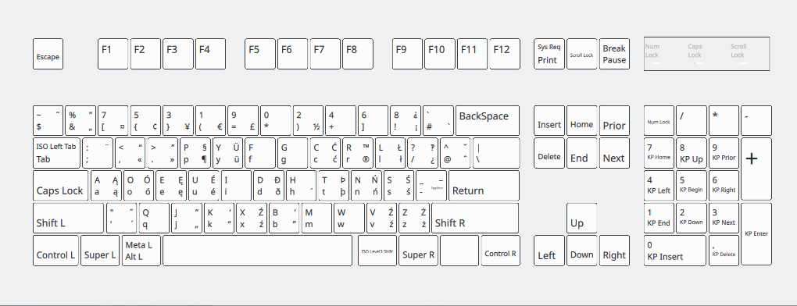
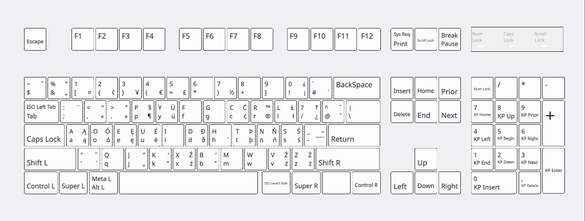

# pl-dvk
Polish Programmer Dvorak keyboard layout, but with digits located crescovely.
# Comparison
<p>
    Basic polish programmer dvorak:
    
    <br>
    Polish programmer dvorak with "proper" numbering:
    
</p>

# Installation
To install, you need to override your default polish keyboard layout with the one from repository:

``` bash
sudo mv pl /usr/share/X11/xkb/symbols/
```